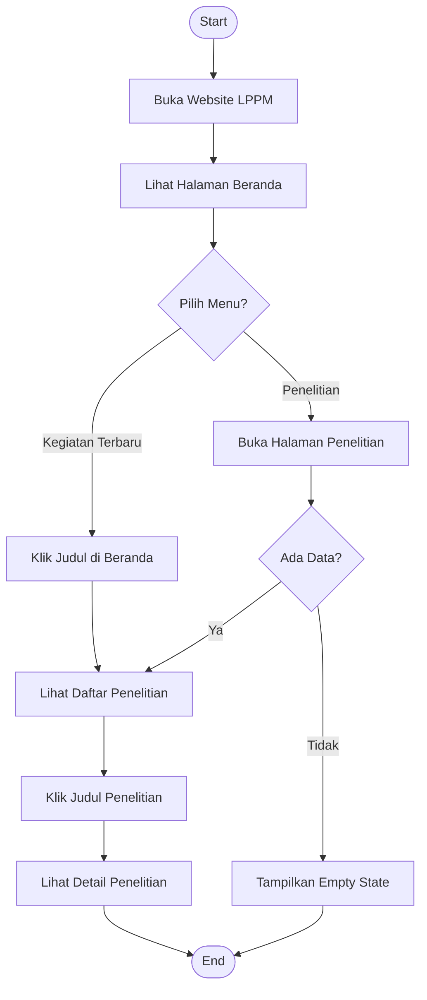
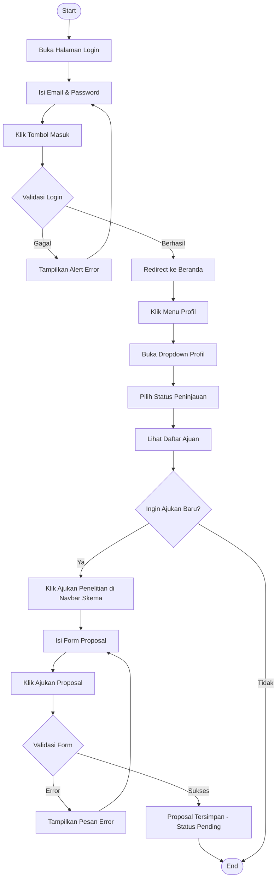
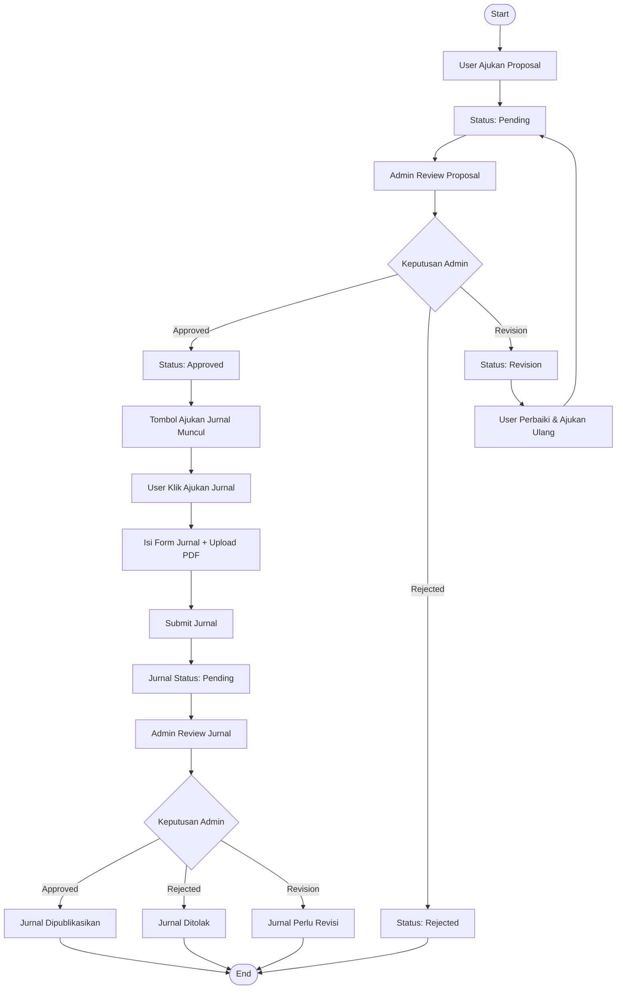
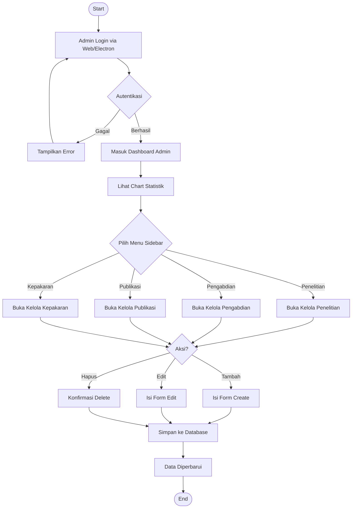
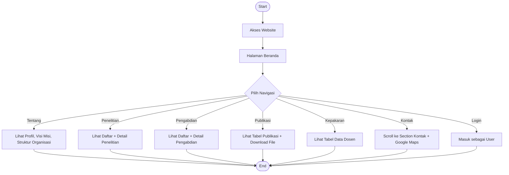
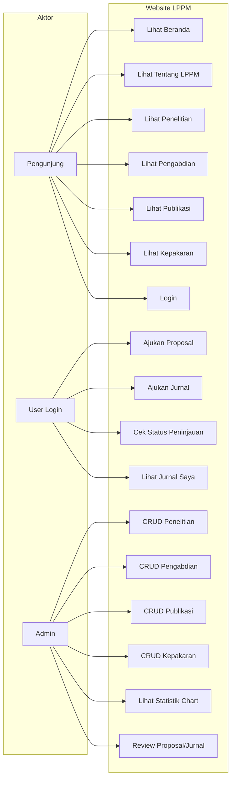
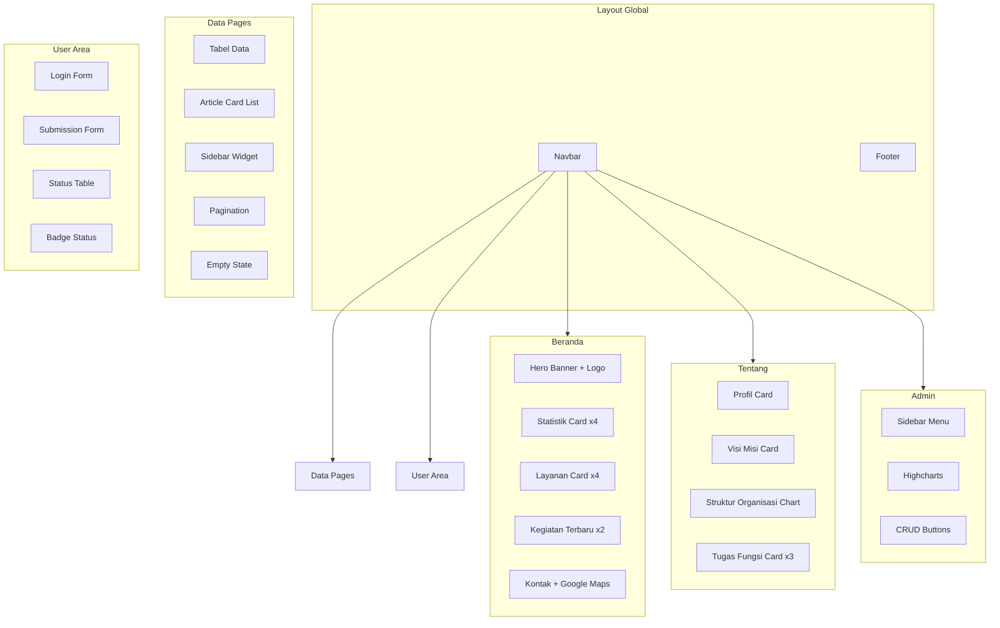

# Dokumentasi User Interface (UI) Website LPPM UCA

> **Proyek:** Website LPPM Universitas Cendekia Abditama  
> **Mahasiswa:** Adam Arias Jauhari — NIM 2322105018 — Absen 16 — Kelas 3TI01  
> **Framework:** Laravel (Blade Templating) + Bootstrap 4 + FontAwesome  

---

## 1. Arsitektur Halaman Website

Website ini memiliki **dua sisi utama**: sisi **Publik** (untuk pengunjung umum) dan sisi **Admin** (untuk pengelola data). Berikut peta seluruh halaman:

```mermaid
graph TD
    A["Website LPPM UCA"] --> B["Sisi Publik"]
    A --> C["Sisi Admin"]

    B --> B1["Beranda /"]
    B --> B2["Tentang /tentang"]
    B --> B3["Penelitian /penelitian"]
    B --> B4["Pengabdian /pengabdian"]
    B --> B5["Publikasi /publikasi"]
    B --> B6["Kepakaran /kepakaran"]
    B --> B7["Produk Riset /riset"]
    B --> B8["Forkomil & Conferences"]
    B --> B9["Paten & Hak Cipta"]
    B --> B10["Login User /login"]
    B --> B11["Ajukan Penelitian"]
    B --> B12["Ajukan Jurnal"]
    B --> B13["Status Peninjauan"]
    B --> B14["Jurnal Saya"]

    C --> C1["Admin Dashboard"]
    C --> C2["Kelola Penelitian"]
    C --> C3["Kelola Pengabdian"]
    C --> C4["Kelola Publikasi"]
    C --> C5["Kelola Kepakaran"]
    C --> C6["Electron Admin Panel"]
```

---

## 2. Komponen UI Global

### 2.1 Navbar (Navigation Bar)
| Elemen | Komponen | Fungsi |
|--------|----------|--------|
| Logo + Teks "LPPM" | `navbar-brand-custom` | Identitas website, klik untuk kembali ke beranda |
| Menu Navigasi | `nav-link` | Link ke halaman: Beranda, Tentang, Penelitian, Pengabdian, Publikasi, Kontak |
| Tombol Login | `btn-login-nav` | Mengarahkan ke halaman login user (gradient emas) |
| Dropdown Profil | `dropdown` | Muncul setelah login — menampilkan nama, role, NIM/NIP, akses ke Status Peninjauan, Jurnal Saya, dan Logout |
| Hamburger Toggle | `navbar-toggler` | Untuk tampilan mobile, membuka/menutup menu |
| Underline Hover | CSS `::after` | Efek garis bawah emas saat hover pada menu |

### 2.2 Footer
| Elemen | Fungsi |
|--------|--------|
| Logo + Deskripsi LPPM | Informasi lembaga |
| Menu Navigasi Footer | Link cepat ke halaman utama |
| Lokasi | Alamat kampus UCA |
| Tautan Eksternal | Link ke SINTA, SIMLITABMAS, website UCA |
| Ikon Sosial Media | Link ke website, Facebook, Instagram, YouTube |
| Copyright | Tahun otomatis via JavaScript |

### 2.3 Hero Banner
| Varian | Digunakan di | Fungsi |
|--------|-------------|--------|
| `home_banner_area` dengan logo | Beranda | Banner utama dengan logo UCA dan nama lembaga + efek parallax |
| `hero-banner` | Semua halaman lain | Banner sub-halaman dengan judul halaman di tengah |

---

## 3. Halaman Publik — Detail UI

### 3.1 Beranda (`index.blade.php`)

**Komponen UI yang digunakan:**

| No | Komponen | Tipe UI | Fungsi |
|----|----------|---------|--------|
| 1 | Hero Banner | Section dengan overlay + parallax | Menampilkan identitas LPPM UCA dengan logo |
| 2 | Statistik Ringkasan | Card grid (4 kolom) | Menampilkan jumlah Penelitian, Pengabdian, Publikasi, Kepakaran secara real-time dari database |
| 3 | Layanan LPPM | Card grid (4 kolom) | Navigasi cepat ke 4 layanan utama dengan ikon dan deskripsi singkat |
| 4 | Kegiatan Terbaru | 2-column card | Daftar penelitian dan pengabdian terbaru, masing-masing dengan judul, tanggal, penulis |
| 5 | Hubungi Kami | Info card + iframe Google Maps | Alamat, email, website, jam operasional + peta lokasi kampus |

### 3.2 Tentang LPPM (`tentang.blade.php`)

| No | Komponen | Tipe UI | Fungsi |
|----|----------|---------|--------|
| 1 | Profil LPPM | 2-column card (hijau + putih) | Deskripsi lembaga dan tugas LPPM |
| 2 | Visi & Misi | 2-column card dengan ikon | Visi di kiri, Misi (list) di kanan |
| 3 | Struktur Organisasi | Org chart vertikal | Rektor → Ketua LPPM → Divisi, dengan foto dan border emas |
| 4 | Tugas & Fungsi | 3-column card | Penelitian, Pengabdian, Publikasi & HKI |

**Komponen khusus:**
- `org-photo-frame` — Bingkai foto rounded-rectangle dengan border emas dan hover effect
- `org-photo-lg` / `org-photo-sm` — Ukuran besar (130×160px) dan kecil (100×120px)
- `org-photo-placeholder` — Placeholder ikon jika foto belum diupload

### 3.3 Penelitian (`berita-penelitian/`)

| Halaman | Komponen UI | Fungsi |
|---------|-------------|--------|
| Index | Article card + thumbnail + tanggal badge | Daftar penelitian dengan gambar, judul, deskripsi, penulis |
| Show | Single post detail + sidebar | Detail lengkap penelitian |
| Create | Form input (judul, slug, penulis, tanggal, deskripsi, thumbnail) | Admin menambah data |
| Edit | Form edit (prefilled) | Admin mengedit data |

**Sidebar (digunakan juga di Pengabdian & Riset):**
- Widget Kategori — link ke Penelitian, Pengabdian, Forkomil
- Widget e-Jurnal — daftar link jurnal UCA

### 3.4 Pengabdian (`pengabdian/`)

| Halaman | Komponen UI | Fungsi |
|---------|-------------|--------|
| Index | Deskripsi panel + article cards | Daftar pengabdian dengan thumbnail, tanggal, deskripsi |
| Show | Detail post + sidebar | Detail lengkap pengabdian |
| Empty State | Ikon + pesan + tombol navigasi | Ditampilkan jika belum ada data |

### 3.5 Publikasi (`publikasi/`)

| Komponen | Tipe UI | Fungsi |
|----------|---------|--------|
| Tabel data | `<table>` Bootstrap | Daftar publikasi: Judul, Penulis, Tanggal, Abstrak |
| Badge Detail | `badge btn-info` | Link ke halaman detail |
| Badge Download | `badge btn-success` | Download file publikasi (jika tersedia) |
| Pagination | Laravel `->links()` | Navigasi halaman |

### 3.6 Kepakaran (`kepakaran/`)

| Komponen | Tipe UI | Fungsi |
|----------|---------|--------|
| Tabel data | `<table>` Bootstrap | Daftar dosen: Nama, NIP, Email, Bidang Kepakaran |
| Badge Detail | `badge btn-info` | Link ke detail kepakaran dosen |

### 3.7 Forkomil & Conferences

| Komponen | Tipe UI | Fungsi |
|----------|---------|--------|
| Card Deck Poster | Bootstrap `card-deck` | Gallery poster kegiatan ilmiah (3 poster) |
| Accordion FAQ | Bootstrap `collapse` | Daftar pertanyaan yang sering diajukan (10 item, 2 kolom) |

### 3.8 Halaman Submission (User Login Required)

#### Form Ajukan Penelitian
| Komponen | Tipe UI | Fungsi |
|----------|---------|--------|
| `submission-card` | Card dengan header gradient hijau | Container form |
| Input Judul | Text input | Judul penelitian |
| Select Jenis | Dropdown select | Jenis: Dasar / Terapan / Pengembangan |
| Textarea Abstrak | Textarea | Abstrak penelitian |
| Input Tim | Text input | Anggota tim (opsional, koma-separated) |
| `btn-submit` | Button hijau full-width | Kirim proposal |

#### Form Ajukan Jurnal
| Komponen | Tipe UI | Fungsi |
|----------|---------|--------|
| Input Judul | Text input | Judul jurnal |
| Input Nama Jurnal | Text input | Jurnal tujuan |
| File Upload | Custom drag-drop area | Upload PDF (maks 10MB) dengan preview nama file |
| Input Penulis | Text input | Nama penulis |

#### Status Peninjauan
| Komponen | Tipe UI | Fungsi |
|----------|---------|--------|
| `status-table` (Proposal) | Tabel custom | No, Judul, Jenis, Tanggal, Status, Catatan, Aksi |
| `status-table` (Jurnal) | Tabel custom | No, Judul, Jurnal Tujuan, Tanggal, Status, Catatan |
| Badge Status | `badge-pending/approved/rejected/revision` | Indikator warna status (kuning/hijau/merah/biru) |
| Tombol Ajukan Jurnal | `btn-ajukan-jurnal` | Muncul jika proposal approved |
| Empty State | Ikon inbox + pesan | Jika belum ada ajuan |

### 3.9 Login User

| Komponen | Tipe UI | Fungsi |
|----------|---------|--------|
| Background | Gradient overlay + foto kampus | Desain full-screen immersive |
| `login-card` | Card putih rounded | Container form login |
| Logo + Heading | Gambar + teks | Identitas LPPM |
| Input Email | Text input dengan ikon | Email pengguna |
| Input Password | Password input dengan ikon | Password pengguna |
| `btn-login` | Button gradient hijau | Submit login |
| Alert Error | `alert-danger` | Pesan error jika login gagal |
| Back Link | Text link | Kembali ke beranda |

---

## 4. Halaman Admin — Detail UI

### 4.1 Layout Admin Dashboard

| Komponen | Tipe UI | Fungsi |
|----------|---------|--------|
| Navbar atas | `navbar-dark bg-primary` | Bar navigasi admin dengan brand "LPPM" |
| Sidebar | `list-group` collapsible | Menu: Dashboard (Penelitian, Pengabdian, Publikasi, Kepakaran), Profile (Logout) |
| Content Area | `@yield('main')` | Area konten utama |

### 4.2 Dashboard Utama

| Komponen | Tipe UI | Fungsi |
|----------|---------|--------|
| Chart Highcharts | Bar chart | Diagram jumlah berita per kategori (3 tahun terakhir) |

### 4.3 Halaman Kelola Data (Penelitian/Pengabdian/Publikasi/Kepakaran)

| Komponen | Tipe UI | Fungsi |
|----------|---------|--------|
| Chart Highcharts | Column chart | Statistik per tahun |
| Daftar Data | List + link | Judul, tanggal, penulis |
| Tombol Tambah | `btn btn-primary` | Navigasi ke form create |
| Tombol Edit | `btn btn-outline-info` | Navigasi ke form edit |
| Tombol Delete | `btn btn-outline-danger` + form | Hapus data dengan method DELETE |
| Pagination | Laravel `->links()` | Navigasi halaman |

### 4.4 Electron Admin Panel (Desktop)

| Komponen | Fungsi |
|----------|--------|
| Token-based Auth | Verifikasi admin via token file |
| CRUD Management | Kelola semua data via API |
| Photo Upload | Upload foto struktur organisasi |
| Stats Dashboard | Statistik keseluruhan data |

---

## 5. Teknologi & Library UI

| Teknologi | Versi/Sumber | Fungsi |
|-----------|-------------|--------|
| Bootstrap | 4.x | Grid system, card, navbar, modal, accordion, table |
| FontAwesome | 5.x | Ikon navigasi, tombol, dan dekorasi |
| Themify Icons | CSS | Ikon tambahan (sosial media, navigasi) |
| Owl Carousel | JS Plugin | Carousel/slider konten |
| Animate.css | CSS | Animasi elemen |
| Highcharts | CDN | Chart/diagram statistik di admin |
| Google Maps Embed | iframe | Peta lokasi kampus |
| Google Fonts (Poppins) | CSS import | Tipografi halaman login |
| jQuery | 2.2.4 | Manipulasi DOM dan AJAX |
| Custom CSS | `style.css`, `responsive.css` | Styling utama dan responsif |

---

## 6. Skema Warna (Color Palette)

| Warna | Kode Hex | Penggunaan |
|-------|----------|------------|
| Hijau Tua (Primary) | `#1a4d2e` | Navbar, heading, tombol utama, sidebar |
| Hijau Medium | `#2a6e42` | Hover state, gradient |
| Emas (Accent) | `#c4992a` | Tombol login, underline aktif, ikon aksen, badge |
| Emas Terang | `#d4a94a` | Hover emas |
| Hijau Background | `#e8f0eb` | Latar belakang ikon dan panel |
| Hijau Soft BG | `#f0f7f2` | Card statistik, info box |
| Abu-abu | `#7f7f7f` | Teks deskripsi |
| Putih | `#ffffff` | Background card utama |
| Off-White | `#f9fafb` | Background section |

---

## 7. Diagram Activity

### 7.1 Activity Diagram — Pengunjung Melihat Penelitian

### 7.2 Activity Diagram — User Login & Ajukan Proposal

### 7.3 Activity Diagram — Alur Proposal Hingga Jurnal

### 7.4 Activity Diagram — Admin Kelola Data

### 7.5 Activity Diagram — Navigasi Umum Pengunjung

---

## 8. Diagram Use Case

---

## 9. Diagram Komponen UI per Halaman

---

## 10. Ringkasan Jumlah Komponen UI

| Kategori | Jumlah | Contoh |
|----------|--------|--------|
| Halaman Publik | 10 | Beranda, Tentang, Penelitian, Pengabdian, dll. |
| Halaman Admin Web | 7 | Dashboard, Kelola Penelitian/Pengabdian/Publikasi/Kepakaran, Create, Edit |
| Halaman User Auth | 5 | Login, Ajukan Penelitian, Ajukan Jurnal, Status, Jurnal Saya |
| Layout Template | 8 | main, admin_dashboard, penelitian, pengabdian, publikasi, riset, kepakaran |
| Komponen Form | 6 | Text input, Textarea, Select, File upload, Password, Button |
| Komponen Tabel | 4 | Publikasi, Kepakaran, Status Proposal, Status Jurnal |
| Komponen Card | 5 | Statistik, Layanan, Kegiatan, Profil, Tugas Fungsi |
| Komponen Chart | 2 | Bar chart (dashboard), Column chart (per kategori) |
| Komponen Navigasi | 4 | Navbar, Sidebar, Footer, Pagination |
| Komponen Feedback | 4 | Alert success, Alert error, Badge status, Empty state |
